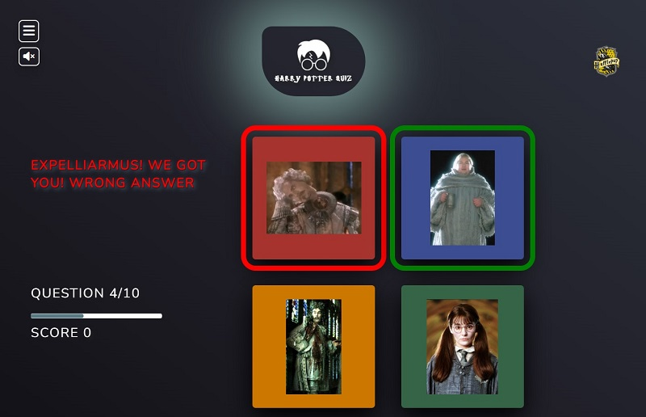
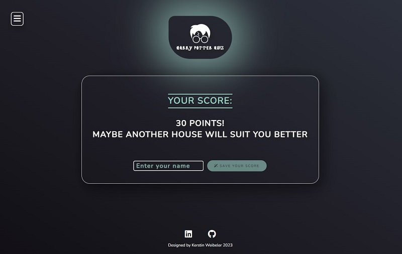

# Harry Potter Quiz

This quiz is built for all Harry Potter fans to answer questions about their favorite Hogwards house to find out how well they fit in. The user can pick between the four houses which each have 10 questions. For each question answered correctly. The Harry Potter quiz is fun and tests all Harry Potter fans.

# Live Project

[View live project here](https://kerstin-w.github.io/harry-potter-quiz/)

## Contents

---

- [User Experience](#ux)
  - [User Stories](#user-stories)
  - [Site Owner Goals](#goals)
- [Design](#design)
  - [Colour Palette](#colour-palette)
  - [Fonts](#fonts)
  - [Images](#images)
- [Wireframes](#wireframes)
- [Features](#features)
    - [Home Page](#homepage)
    - [Game Page](#game-page)
    - [Game End Page](#game-end)
    - [Game Score Page](#game-score)
- [Technologies](#technologies)
- [Testing](#testing)
- [Deployment](#deployment)
- [References & Credit](#references-credit)

## <a name="ux">User Experience</a>

---

### <a name="user-stories">User Stories</a>

- As a user, I want to understand what the game is about.
- As a user, I want to easily navigate through the game even on the first visit.
- As a user, I want to access the game easily.
- As a user, I want to be able to see my final result.

### <a name="goals">Site Owner Goals</a>

- As a site owner, I want to build an appealing online quiz.
- As a site owner, I want to build a quiz which is easy to navigate.
- As a site owner, I want to build a quiz which is fun for the user and keeps users attention.

## <a name="design">Design</a>

---

### <a name="colour-palette">Colour Palette</a>

**Main Colour Palette** (used for Background, Fonts, Buttons, etc.)

[_Sourced via ColorSpace._](https://mycolor.space/)

**Hogwards House Colours**

[_Sourced via ColorsWall._](https://colorswall.com/palette/167374)

A simple color palette was chosen to reflect the dark and magical character of the Harry Potter world. The background has a dark gradient and the white or light turquoise font stands out well and is easy to read. For the game, the colors of the four Hogwards houses were adopted again to stay in the theme. However, the original yellow had to be changed to orange because of insufficient contrast.

### <a name="fonts">Fonts</a>

**Heading:** For Heading 1, ""Harry Potter" font was selected, which is very unique and directly recognized by users. This stands out beautifully as the heading.

[_Sourced via CDN Fonts._](https://www.cdnfonts.com/harry-potter.font)

**Body:** “Nunito”. This font is simple, modern open and easy to read. The round cap strokes matches well with the round box design on the page.

[_Sourced via Google Fonts._](https://fonts.google.com/)

### <a name="images">Images</a>

[_Sourced via KindPng._](https://www.kindpng.com/) & [_Sourced via Harry Potter Wiki._](https://harrypotter.fandom.com/)

- The symbols of the four Hogward houses were used as images.

- Images of Hogward's symbols, ghosts, and students in the game were used as choices for answers.

## <a name="wireframes">Wireframes</a>
---

[Desktop](assets/readme/desktop.pdf)

[Tablet](assets/readme/tablet.pdf)

[Mobile](assets/readme/mobile.pdf)

## <a name="features">Features</a>

---

### <a name="homepage">Home Page</a>

- An appealing design and an intuitive navigation and orientation on the website.
- A website which is fully responsive on all screen sizes
- Easy access to start the game

* The user is greeted with the logo of the Harry Potter quiz, which immediately intrigues the user and also creates a very magical look due to the box shadow. By clicking on the logo or by scrolling down the user gets to the selection of the game.

### Game Choice 

* The user can choose between one of the four houses. The player's choice is passed on to the game function by an event listener. The Hamburger stays sticky on the homepage allowing the user to navigate easily to the instructions.

### Side Navigation

* The hambuger is sticky on the homepage allowing the user to reach the navigation at any time.
Once the user clicks on the hambuger icon, the navigation will slide out. On desktop it pushes the content to the right and on mobile it takes up 100% of the screen. If the side navigation was closed by clicking on the X the content will slide back to the left.

### Footer 

* The footer section includes links to the relevant sites which open in a new tab, when clicked.

### <a name="game-page">Game Page</a>

* On the Game Page, the corresponding questions and answers are loaded according to the user's previous selection. 
At the top right, the corresponding house logo is loaded.

* The user receives feedback in text form once an answer has been selected, indicating whether the answer was correct or incorrect. Furthermore, the correct answer choice is also marked in color. The scoreboard shows which question the user is currently on. The progress is also displayed graphically in the progress bar. For each correct answer the user receives 10 points which are added up in the score counter. 

### <a name="game-end">Game End Page</a>

* When the user has completed the 10 house questions, the user is redirected automatically to the game end page. The user will get the final score and a message, depending on the score. The user can enter their username and save the points. The button is disabled and will be enabled as soon as the input field is filled in.

### <a name="game-score">Game Score Page</a>

* The user is presented with a table with the current score and the saved ones. The name of the score and the house that was played are displayed.