# Testing

## Contents

- [Functional Testing](#functional-testing)
- [Validator Testing](#validator-testing)
  - [HTML](#html)
  - [CSS](#css)
  - [JS](#js)
- [WAVE](#wave)
- [LightHouse](#lighthouse)
  - [Destop Results](#desktop-results)
  - [Mobile Results](#mobile-results)
- [Browser Compatibility](#browser-compatibility)
- [Responsivity](#responsivity)
- [User Stories](#user-stories)
- [Site Owner Goals](#goals)
- [Issues/ Bugs Found & Resolved](#issues-bugs)
- [Unresolved](#unresolved)

## <a name="functional-testing">Functional Testing</a>

---

| Page       | Test                                                                                   | Completed successfully |
| :--------- | :------------------------------------------------------------------------------------- | :--------------------: |
| All        | Navigation links to relevant pages                                                     |          Yes           |
| All        | Navigation hover effect                                                                |          Yes           |
| All        | Navigation pushes content to the right when toggled                                    |          Yes           |
| All        | Navigation takes over 100% of the scrennt when toggled on mobile                       |          Yes           |
| All        | Logo links back to homepage                                                            |          Yes           |
| All        | Social media icons in the footer link to the correct external link and open in new tab |          Yes           |
| Homepage   | Harry Potter Logo links to main section to start the game                              |          Yes           |
| Homepage   | Images and text flex responsively                                                      |          Yes           |
| Homepage   | New game open with the house selected by user                                          |          Yes           |
| Game       | Images and text flex responsively                                                      |          Yes           |
| Game       | New game loads a random question of the selected house                                 |          Yes           |
| Game       | Scorebaord increments number of questions, score and progress bar                      |          Yes           |
| Game       | Green border is applied to correct answer an red border is applied to incorrect answer |          Yes           |
| Game       | Push current question out of question array                                            |          Yes           |
| Game       | Audio plays when clicked                                                               |          Yes           |
| Game End   | Final Score is displayed                                                               |          Yes           |
| Game End   | Appropiate text depending on score is displayed                                        |          Yes           |
| Game End   | User can only submit when all required fields are filled in                            |          Yes           |
| Game Score | Username, score and selected house logo are displayed                                  |          Yes           |
| Game Score | Previous scores are displayed                                                          |          Yes           |
| Game Score | Clear button deletes local storage of scores                                           |          Yes           |

## <a name="validator-testing">Validator Testing</a>

---

### <a name="html">HTML</a>

[W3C Markup Validator](https://validator.w3.org/)

The initial test returned an error for the audio type on the Game page and a warning on the game score page.

Initial test

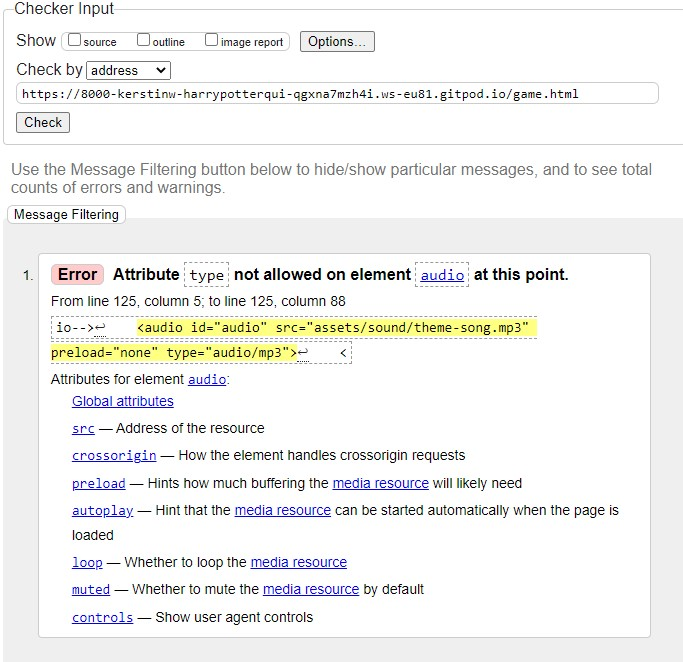

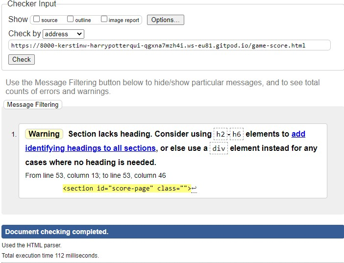

Homepage

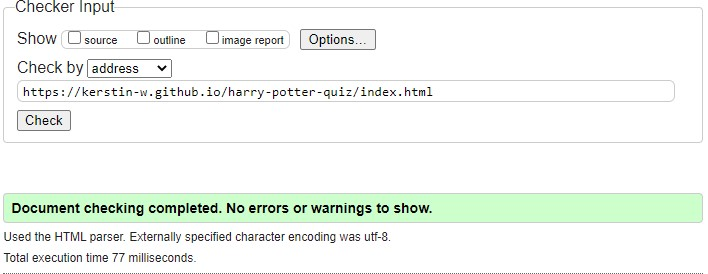

Game Page

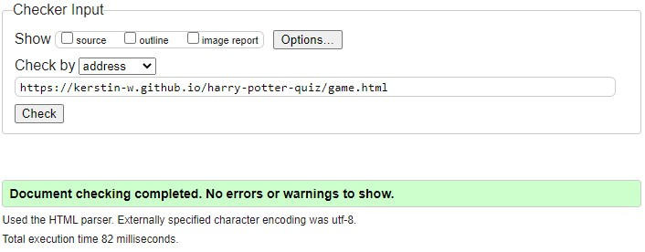

Game End

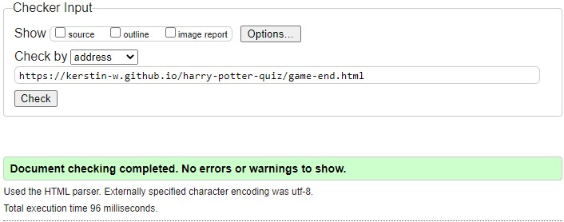

Score Page

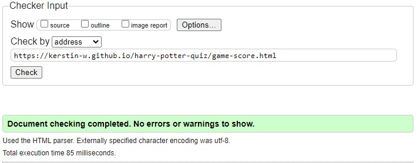

Instruction

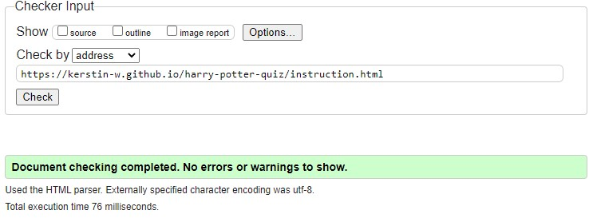

### <a name="css">CSS</a>

[W3C CSS Validator](https://jigsaw.w3.org/css-validator/)

This test returned no errors.
Results of the CSS test of style.css:

Result

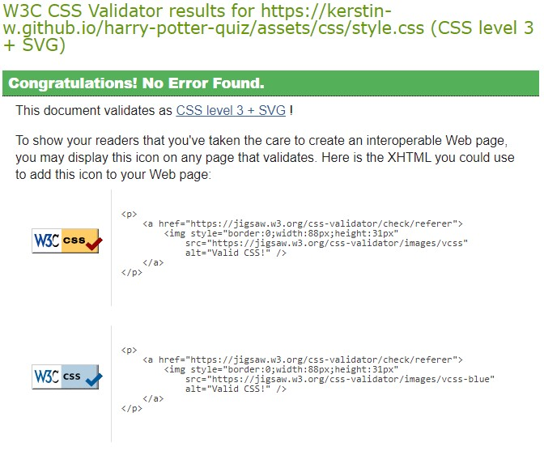

### <a name="js">JS</a>

[JSHint JS Validator](https://jshint.com/)

All JavaScript files were validated through JSHint.

Result

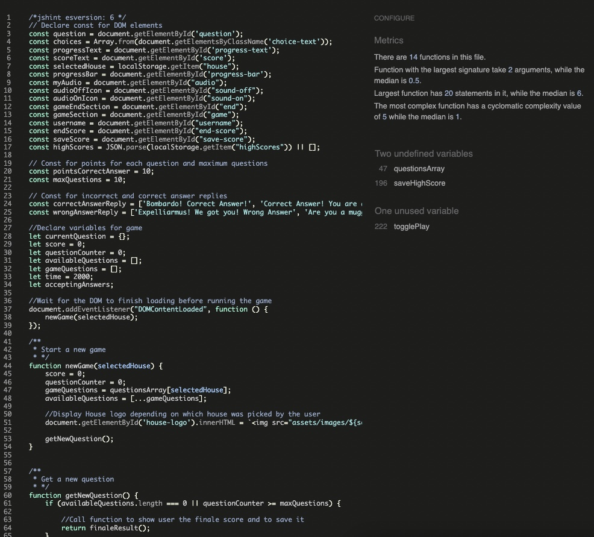

## <a name="wave">WAVE</a>

---

[WAVE](https://wave.webaim.org/)

The WAVE WebAIM web accessibility evaluation tool was used to check for accessibility standards.

The first result gave an contrast error for the yellow house box with white text. Therefore the original Huffelpuff yellow needed to be changed to an orange color.

Afterwards, all pages passed with zero error.

Result

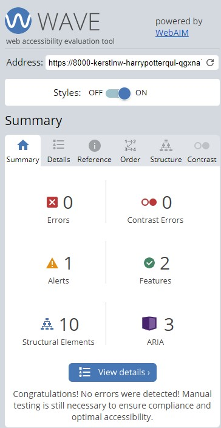

## <a name="lighthouse">LightHouse</a>

---

Lighthouse was used (accessed through Developer Tools in Chrome) to analyse for the following:

- Performance
- Accessibility
- Best practice
- SEO

### Desktop Results

Homepage

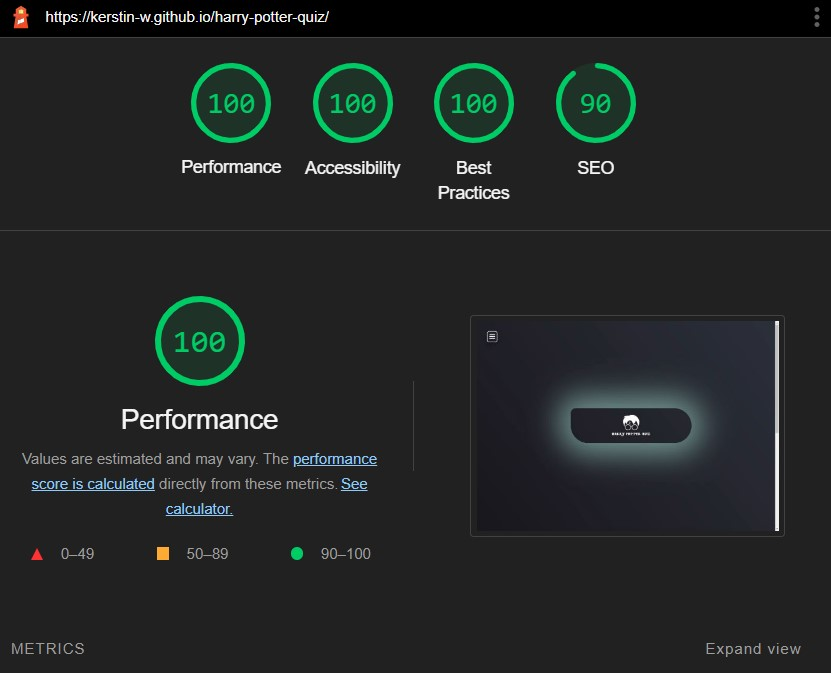

Game Page

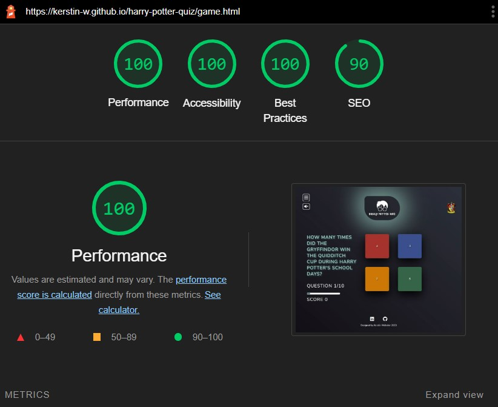

Game End Page

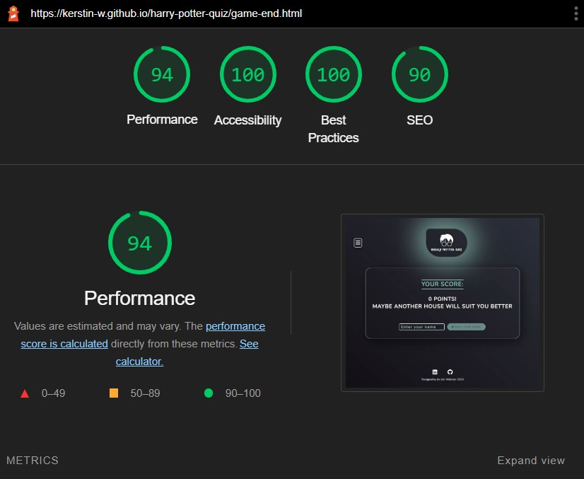

Score Page

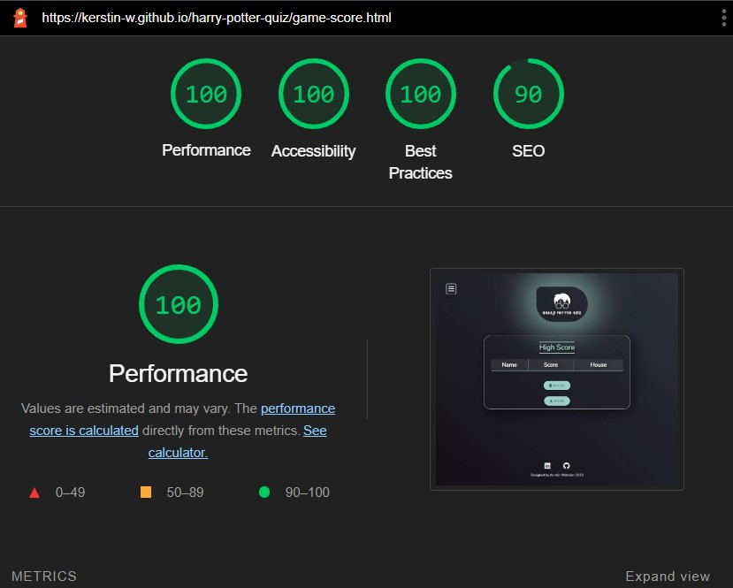

Instruction Page

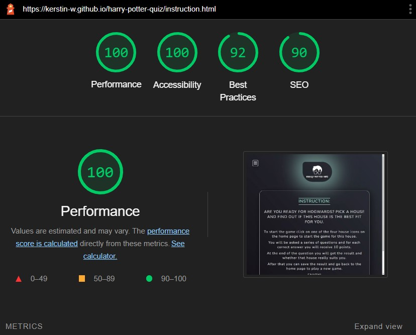

### Mobile Results

Homepage

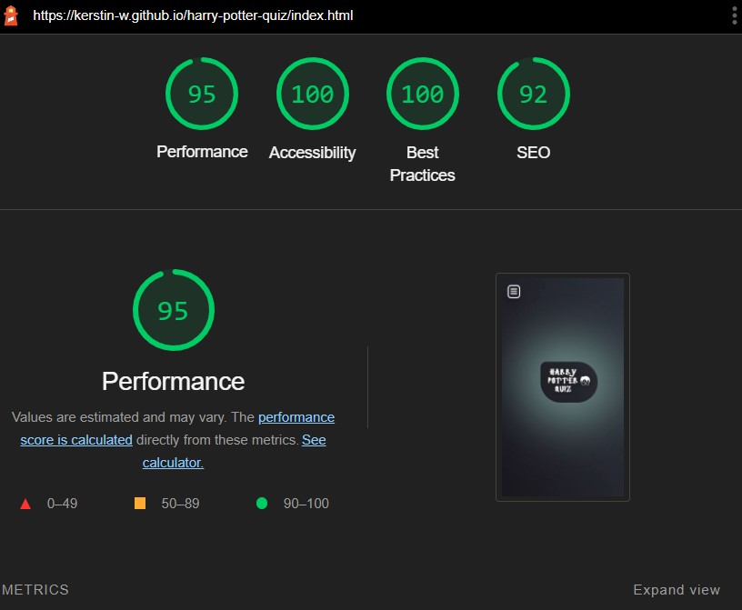

Game Page

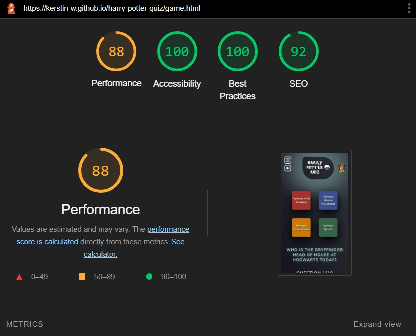

Game End Page

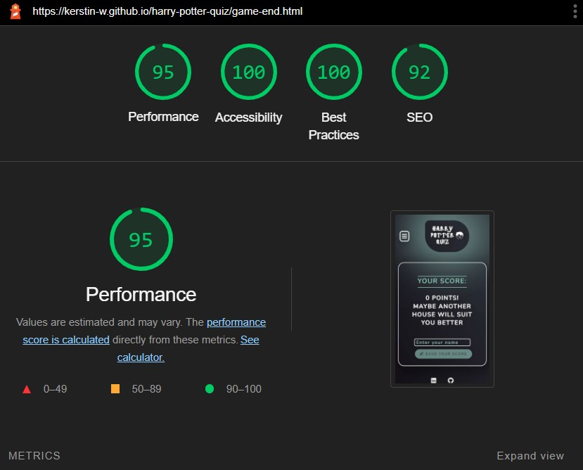

Score Page

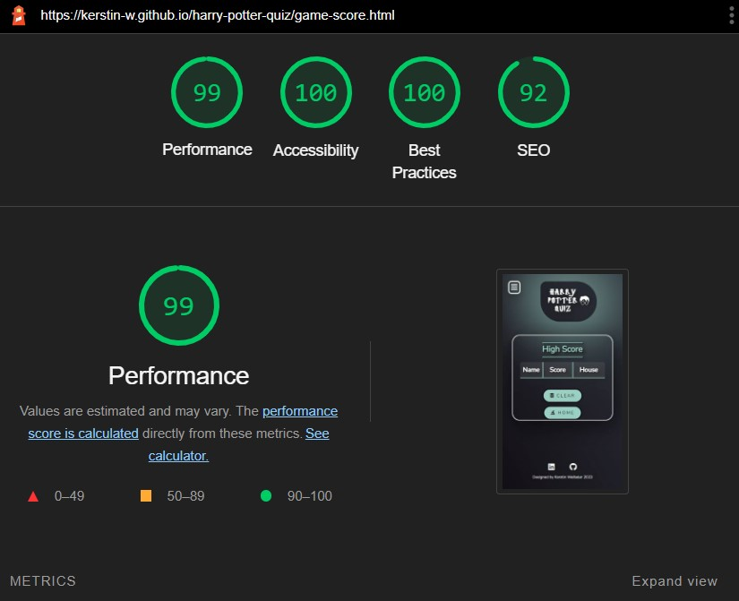

Instruction Page

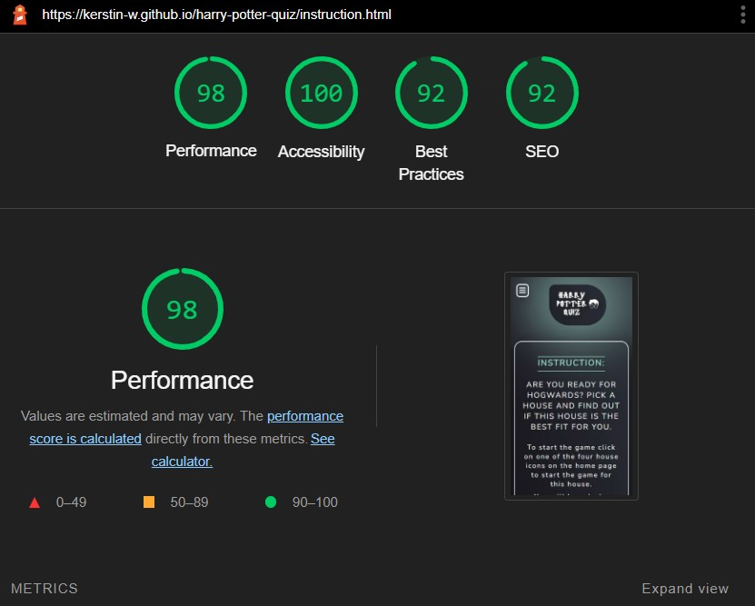

## <a name="browser-compatibility">Browser Compatibility</a>

---

This website was tested on Chrome, Microsoft Edge, and Firefox for desktop.

The website was tested on Safari for mobile and tablet.

- The outline hover effect for the house boxes appeared to be a problem in Safari. See [Unresolved](#unresolved).
